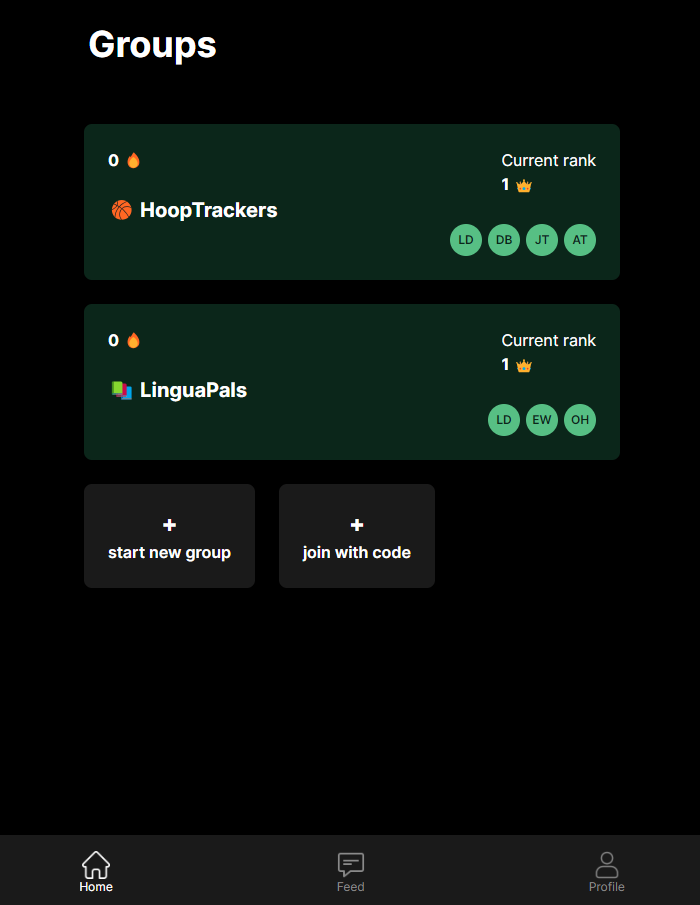
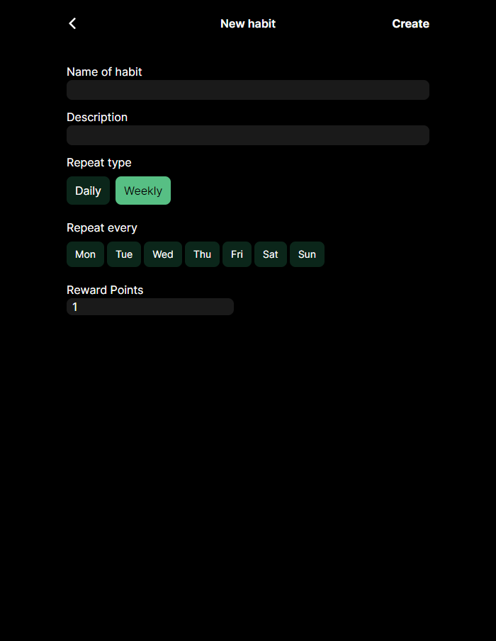
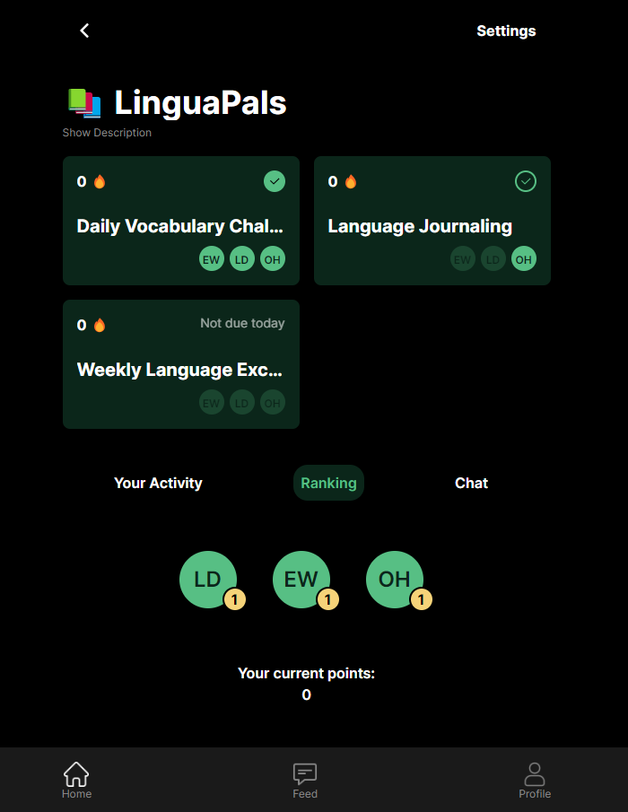
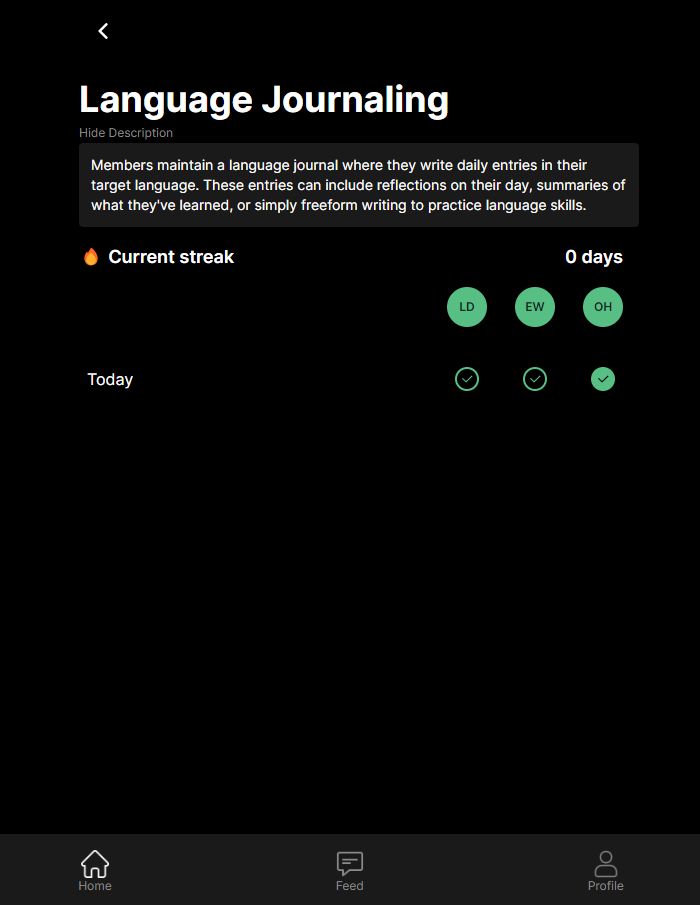
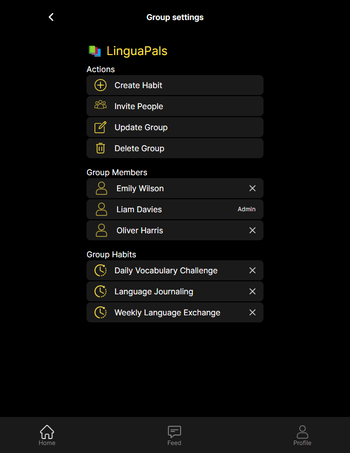
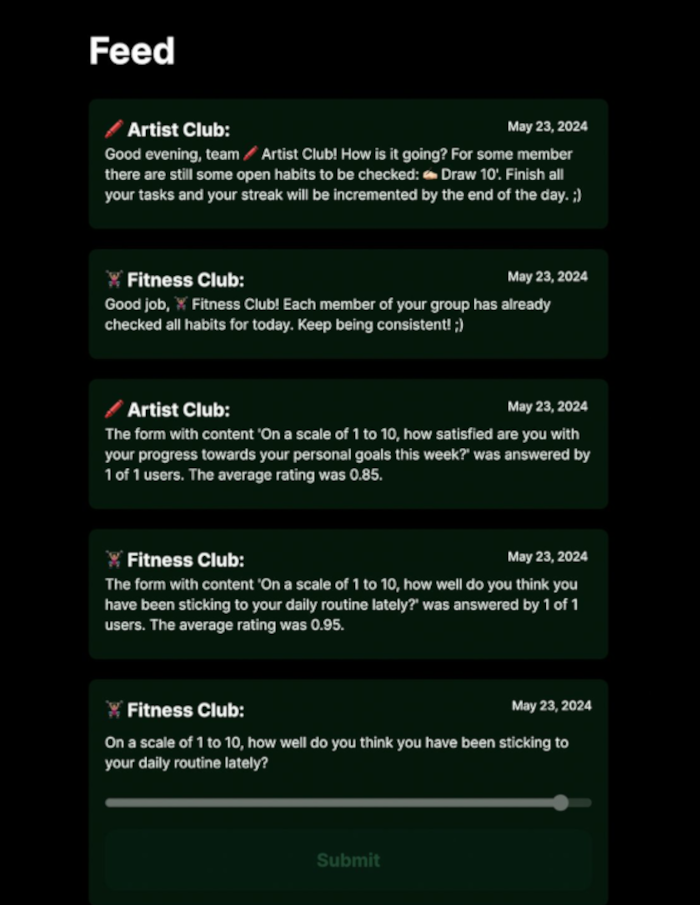
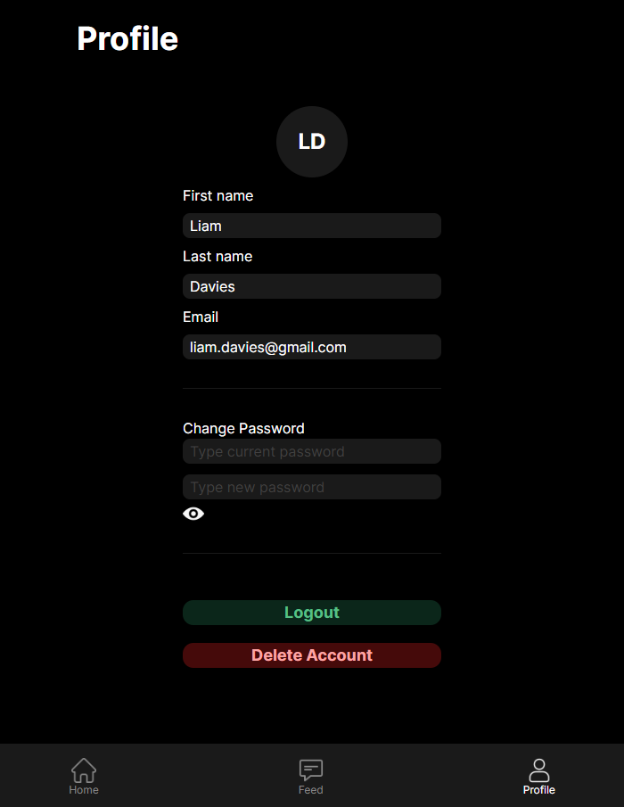

# SoPra FS24 Gruppe 29 - RapidTracker
## Table of contents

- [Introduction](#introduction)
- [Technologies](#technologies)
   * [Figma:](#figma)
   * [Vite (instead of Create React App):](#vite-instead-of-create-react-app)
   * [Tailwind CSS:](#tailwind-css)
   * [React with Typescript:](#react-with-typescript)
   * [PWA (as a extra mile):](#pwa-as-a-extra-mile)
- [High-level components](#high-level-components)
   * [Users and Groups](#users-and-groups)
   * [Habits](#habits)
   * [ChatRooms](#chatrooms)
   * [FeedMessages](#feedmessages)
   * [OpenAI API](#openai-api)
 - [Roadmap](#roadmap)
   * [Feature 1 - Adding pre-defined Habits](#feature-1-adding-pre-defined-habits)
   * [Feature 2 - Adding public groups](#feature-2-adding-public-groups)
   * [Feature 3 - Implementing push notifications](#feature-3-implementing-push-notifications)
   * [Feature 4 - Adding color to groups](#feature-4-adding-color-to-groups)
   * [Feature 5 - Changing the authorization principle](#feature-5-changing-the-authorization-principle)
- [Launch & Deployment](#launch-deployment)
   * [Getting started with Yarn](#getting-started-with-yarn)
   * [Setting up the environment](#setting-up-the-environment)
      + [1. Install yarn](#1-install-yarn)
      + [2. Install dependencies](#2-install-dependencies)
      + [3. Run the development server](#3-run-the-development-server)
- [Illustrations](#illustrations)
- [Authors](#authors)
- [Acknowledgement](#acknowledgement)
- [License](#license)

<!-- TOC end -->

<!-- TOC --><a name="introduction"></a>
## Introduction
Maintaining motivation while forming good habits and defeating bad ones can sometimes be a challenge. Often, individuals struggle to establish and sustain good habits due to a lack of support and accountability. Our solution is a collaborative habit tracking app that relies on communal support to foster the motivation. It allows users to form groups to collectively set, monitor, and achieve habitual goals.If all goals are achieved by each member, the group receives streaks. And to increase competition within a given group, every member can earn reward points for each habit completed. This approach harnesses the power of gamification and social accountability to make habit formation more engaging and successful. The aim of the application is to help its users to establish healthy habit routines while relying on the positive effects of group dynamics and support networks.

<!-- TOC --><a name="technologies"></a>
## Technologies
<!-- TOC --><a name="figma"></a>
### Figma:
We used Figma for the design Mockups.

<!-- TOC --><a name="vite-instead-of-create-react-app"></a>
### Vite (instead of Create React App):
Vite is a modern front-end build tool that enhances development efficiency by utilizing native ES modules, which enable instant server starts and real-time updates through hot module replacement.

It outperforms Create React App with significantly faster server start-up times and avoids unnecessary re-bundling. Additionally, its flexible configuration and efficient Rollup-based production builds make Vite an ideal choice for streamlined and high-performance web development.

<!-- TOC --><a name="tailwind-css"></a>
### Tailwind CSS:
Tailwind CSS is a utility-first framework that facilitates rapid UI development by allowing custom designs directly in HTML using predefined classes. It enhances responsiveness and reduces the need for custom CSS, significantly speeding up the development process and simplifying maintenance.

<!-- TOC --><a name="react-with-typescript"></a>
### React with Typescript:
React, combined with strict TypeScript, is a powerful setup for building scalable and maintainable web applications, providing a component-based architecture along with static type checking. This integration enhances development efficiency and reliability by catching errors early in the development process and offering more predictable code behavior.

<!-- TOC --><a name="pwa-as-a-extra-mile"></a>
### PWA (as a extra mile):
A Progressive Web App (PWA) built with React utilizes React's component-based architecture to create applications that behave like native apps but are delivered via the web.


<!-- TOC --><a name="high-level-components"></a>
## High-level components
<!-- TOC --><a name="users-and-groups"></a>
### [Users](src/main/java/ch/uzh/ifi/hase/soprafs24/entity/User.java) and [Groups](src/main/java/ch/uzh/ifi/hase/soprafs24/entity/Group.java)
- Role: A user can create a group in which administrators are automatically added. They can then invite other people to join them and complete the habit together.
- Relation: The habits can be created and managed in a group.

<!-- TOC --><a name="habits"></a>
### [Habits](src/main/java/ch/uzh/ifi/hase/soprafs24/entity/Habit.java)
- Role: Habits can be created with a name, a description, a specific repeat strategy (daily, or on certain days of the week), and a score to be obtained by achieving the habit. The habits can then be checked on/off by all group members.
- Relation: The habits are group-specific and not cross-group.

<!-- TOC --><a name="chatrooms"></a>
### [ChatRooms](src/main/java/ch/uzh/ifi/hase/soprafs24/service/ChatRoomService.java)
- Role: So that users can support and motivate each other, there is a group chat in which messages can be sent.
- Relation: The group chat is created directly when a group is created and also loads a certain number of past messages each time so that new group members can also read the messages.

<!-- TOC --><a name="feedmessages"></a>
### [FeedMessages](src/main/java/ch/uzh/ifi/hase/soprafs24/service/FeedMessageService.java)
- Role: This component is used to send messages with group-related content to each user. These messages include Pulse Check Messages as well as Evening Notification.
- Relation: The meetings are group-specific and not cross-group. They also serve to motivate and network the group.

<!-- TOC --><a name="openai-api"></a>
### [OpenAI API](src/main/java/ch/uzh/ifi/hase/soprafs24/service/OpenAIService.java)
- Role: At 07:00 AM (Zurich Time) each morning, the OpenAI API is utilized to generate a questionare (Pulse Check) for each group. These questions are sent to the feed of each user. After the Pulse Check gets closed at 12:00 AM (Zurich Time) each user receives a feedback about the result.
- Relation: The messages are sent to all users via feed and are individualized to support the users in achieving their goals.

<!-- TOC --><a name="roadmap"></a>
## Roadmap
If we were to continue working on our application after the module, or if a new developer were to join us, we would first add the following features:

<!-- TOC --><a name="feature-1-adding-pre-defined-habits"></a>
### Feature 1 - Adding pre-defined Habits
First, we would create pre-defined habits in the database, which could then be selected by new group administrators when creating new habits. This would support inexperienced users when using the application for the first time and make it easier to get started.

<!-- TOC --><a name="feature-2-adding-public-groups"></a>
### Feature 2 - Adding public groups
Public groups could also be created to network with other people with similar goals and improve their own performance together

We deliberately did not include this feature in our project because we did not want to lose any time or take any avoidable risks due to possible misuse of the application by third parties.

<!-- TOC --><a name="feature-3-implementing-push-notifications"></a>
### Feature 3 - Implementing push notifications
Another step forward would be to receive push notifications for important events. an example of this could be when the pulse check is started, when a new user joins the group or when the AI coach gives feedback on their own habits.

<!-- TOC --><a name="feature-4-adding-color-to-groups"></a>
### Feature 4 - Adding color to groups
A relatively small but very useful update would be to add a color to each group. This could provide a better overview on the group dashboard and improve the overall user experience of the application.

<!-- TOC --><a name="feature-5-changing-the-authorization-principle"></a>
### Feature 5 - Changing the authorization principle
The authorization principle could also be adapted. currently, only the admin of a group can manage the habits and group members. Here it could be considered whether the admin can appoint further admins, or whether the authorizations should be broken down further in order to separate the administration of the habits and the group members.

<!-- TOC --><a name="launch-deployment"></a>
## Launch & Deployment
Before you can start our applications you need to do some steps for the Backend as well as for the frontend as explained below.

<!-- TOC --><a name="getting-started-with-yarn"></a>
### Getting started with Yarn
We use Yarn instead of npm because it provides faster, more reliable package installations.

-   Documentation: https://yarnpkg.com/advanced/error-codes
-   Guides: https://yarnpkg.com/getting-started

<!-- TOC --><a name="setting-up-the-environment"></a>
### Setting up the environment
<!-- TOC --><a name="1-install-yarn"></a>
#### 1. Install yarn
```bash
npm install --global yarn
```

<!-- TOC --><a name="2-install-dependencies"></a>
#### 2. Install dependencies
```bash
yarn
```

<!-- TOC --><a name="3-run-the-development-server"></a>
#### 3. Run the development server
```bash
yarn dev
```

<!-- TOC --><a name="illustrations"></a>
## Illustrations
<div style="display: flex; align-items: center;">
    
    <div style="margin-left: 20px;">
        <p>Upon successful login or registration, users are directed to their dashboard, where they can view all their groups alongside streaks, ranks, and member information. From here, they can easily navigate to a specific group or choose to create or join a new one, facilitating seamless engagement and community interaction.</p>
    </div>
</div>

<br>

<div style="display: flex; align-items: center;">
    
    <div style="margin-left: 20px;">
        <p>The admin has the capability to create habits by specifying a name, description, reward points, and frequency, choosing between daily repetition or specific days of the week. This feature empowers tailored habit formation, enabling users to track progress and earn rewards according to their desired schedule.</p>
    </div>
</div>

<br>

<div style="display: flex; align-items: center;">
    
    <div style="margin-left: 20px;">
        <p>The group overview presents a comprehensive snapshot of tracked habits, recent activities, member rankings, and a dedicated chat section. This streamlined interface fosters efficient communication, progress tracking, and engagement within the group, enhancing collaboration and motivation among members.<p/>
    </div>
</div>

<br>

<div style="display: flex; align-items: center;">
    
    <div style="margin-left: 20px;">
        <p>The habit history feature logs the description, completion records of each member, and the current streak. This comprehensive tracking system provides insights into individual progress and group performance, fostering accountability and motivation for habit formation.</p>
    </div>
</div>

<br>

<div style="display: flex; align-items: center;">
    
    <div style="margin-left: 20px;">
        <p>In the admin settings, administrators possess the authority to invite or remove users, modify habits, and update group details. This centralized control ensures efficient management of user access, habit configurations, and group dynamics, facilitating smooth administration and customization of the platform.</p>
    </div>
</div>

<br>

<div style="display: flex; align-items: center;">
    
    <div style="margin-left: 20px;">
        <p>The feed function initiates a daily "Pulse Check" survey that measures the state of mind of each group member, which is then evaluated and returned back to the group. The survey is initialized everyday at 07:00 AM (Zurich Time). At 12:00 AM the survey gets closed and the results of each survey gets published for each group via feed message. At 06:00 PM each user receives a group-related evening notification summarizing which habits have been completed and which habits are still to be checked by some group members.</p>
    </div>
</div>

<br>

<div style="display: flex; align-items: center;">
    
    <div style="margin-left: 20px;">
        <p>The profile section allows users to edit personal details such as their name, and provides options to log out or delete their account altogether. This ensures users have control over their account information and can manage their presence on the platform according to their preferences.</p>
    </div>
</div>


<!-- TOC --><a name="authors"></a>
## Authors
- [Lukas Gübeli](https://github.com/lguebeli) (BackEnd Developer)
- [Yannik Riederer](https://github.com/YRiederer) (FrontEnd Developer)
- [Simon Hafner](https://github.com/SimonHafner) (BackEnd Developer)
- [Raksmey Oum](https://github.com/rocketraksi) (FrontEnd Developer)

See also the list of [contributors](contributions.md) who participated in this project.

<!-- TOC --><a name="acknowledgement"></a>
## Acknowledgement
We'd like to thank [Sijing Qin](https://github.com/SerendipitousJourney), who has been our personal Tutor during the last three months and has provided us with the required guidance and expertise.

<!-- TOC --><a name="license"></a>
## License
This project is licensed under the GNU GPLv3 License - see the [LICENSE.md](LICENSE) file for details
